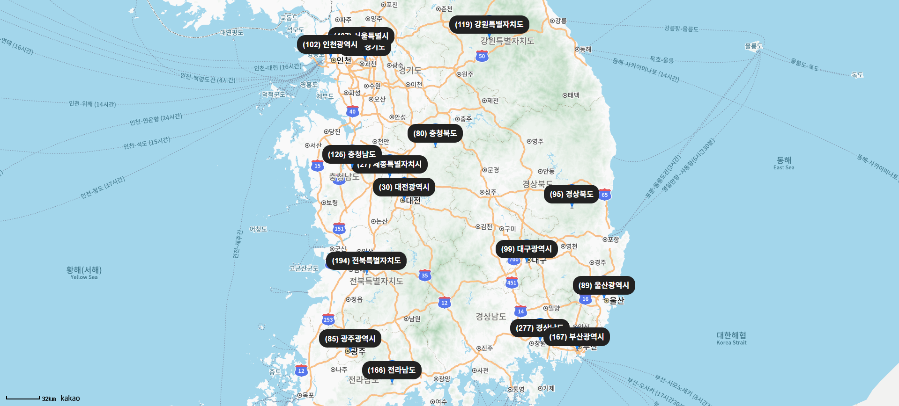
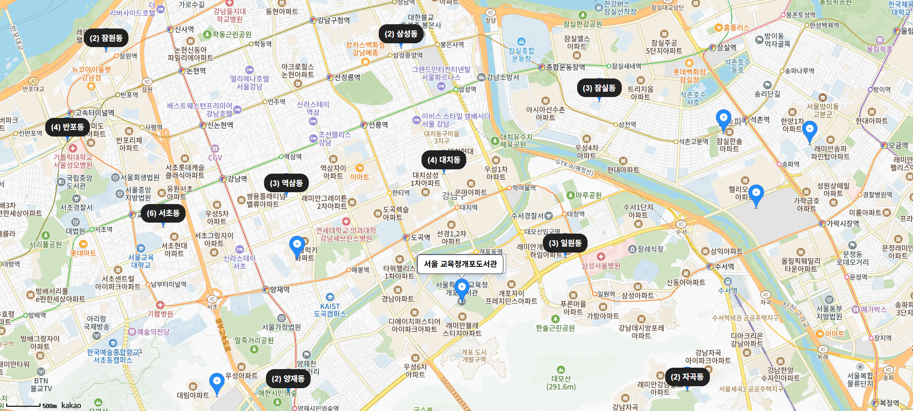

# LinkBook with Next.js

## 🚀 프로젝트 개요
- Next.js 기반으로 제작한 책이음 도서관 지도 서비스
- 카카오 지도 SDK를 활용한 도서관 위치표시와 행정구역별 묶음 기능 제공

---

## 기능구현
- 지도 내에 각 지역별로 책이음 도서관 수 확인 가능, 클릭시 확대.
- vercel로 퍼블리싱

---

## 동작화면

---

## 추후 구현예정 기능들
- 코드정리 및 스타일 개선
- 사용자의 위치정보를 받아 근처에 있는 책이음도서관 위치를 띄워주는 네비게이션 + 자체 UI 제작 / 웹앱 배포
